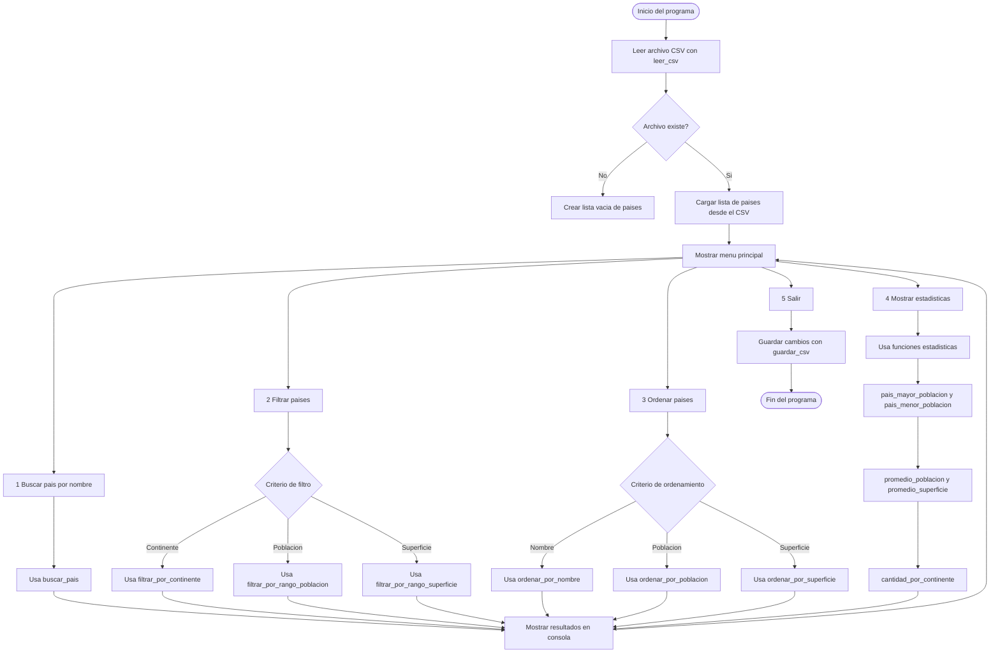

> Proyecto académico para la materia **Programación I - UTN**  
> Aplicación modular en Python que gestiona información de países mediante un archivo CSV.

## Tecnologías y conceptos aplicados

- **Estructuras:** Listas y Diccionarios
- **Persistencia de datos:** Archivos CSV
- **Paradigma:** Programación estructurada
- **Validaciones:** Control de entrada de usuario
- **Módulos:** CSV, OS

## Tabla de Contenidos
- [Descripcion](#-descripcion)
- [Instrucciones de uso](./Aplicacion)
- [Diagrama de flujo](TPI#diagrama-de-flujo)
- [Participacion de los integrantes](#-participacion-de-los-integrantes)

## [Descripcion](#descrpcion)
Este programa permite gestionar información de países mediante una interfaz de consola.  
Permite leer los datos desde un archivo CSV, buscar, filtrar, ordenar y calcular estadísticas básicas como población promedio o país con mayor superficie.  

El sistema utiliza estructuras de datos como listas y diccionarios, y organiza el código mediante funciones modulares.

------------

## [Diagrama de flujo](#-Diagrama-de-flujo)

------------

## [Participacion de los integrantes](#-participacion-de-los-integrantes)

- [**Juan José**](https://www.linkedin.com/in/juan-jose-benitez-539298123/): Desarrollo de funciones principales, manejo de archivos CSV, filtrado, ordenamiento y estadísticas.
- **Enrique**: Implementación del menú principal, validaciones de entrada, interfaz por consola y conexión entre módulos.
------------

*Proyecto realizado para la materia Programación I (UTN 2025).*
