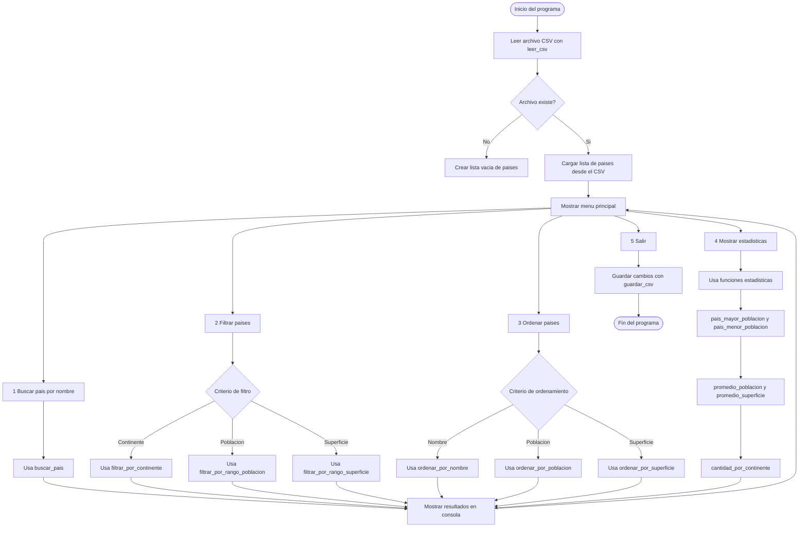

<p align="center">
  
  
  
</p>

<h1 align="center"> Sistema de Gestión de Países</h1>

**Trabajo Práctico Integrador (TPI) - Programación 1**

Este proyecto es un sistema de consola desarrollado en Python que permite gestionar, filtrar, ordenar y analizar datos de países cargados desde un archivo CSV.


**Tecnologías y conceptos aplicados**

- **Estructuras:** Listas y Diccionarios
- **Persistencia de datos:** Archivos CSV
- **Paradigma:** Programación estructurada
- **Validaciones:** Control de entrada de usuario
- **Módulos:** CSV, OS
- **Fuente bibliográfica:** CURSO INTENSIVO DE PYTHON 3ªEDICIÓN Introducción práctica a la programación basada en proyectos Eric Matthes (Editorial Anaya MULTIMEDIA)

**Tabla de Contenidos**
- [Diagrama de flujo](#diagrama-de-flujo)
- [Descripcion](#descripcion)
- [Instrucciones de uso ](#instalacion-y-ejecucion)
- [Participacion de los integrantes](#integrantes-y-roles)
- [Descarga del proyecto](https://github.com/Arcademys/UTN-TUPaDProgramacion1/raw/refs/heads/main/TPI/Aplicacion/Proyecto_completo.rar)
---

## [Diagrama de flujo](#-Diagrama-de-flujo)




---

## [Descripcion](#descrpcion)
El presente Trabajo Práctico Integrador (TPI) consiste en el desarrollo de una aplicación de consola en Python diseñada para la gestión y análisis de datos geográficos y demográficos. El objetivo principal del proyecto fue crear un sistema capaz de leer una base de datos externa (en formato CSV) y ofrecer al usuario una interfaz interactiva para explorar esa información.

A través de un menú de opciones, el sistema permite realizar búsquedas específicas de países, aplicar filtros por diversos criterios (continente, población, superficie), ordenar los resultados y visualizar estadísticas globales. Este proyecto nos permitió integrar y aplicar los conceptos fundamentales de la estructura de programación, tales como el manejo de estructuras de datos complejas (listas de diccionarios), la modularización mediante funciones y el uso de control de flujo para la interacción con el usuario.


---

## [Instalacion y Ejecucion](#instalacion-y-ejecucion)

Para ejecutar este proyecto, sigue estos pasos:

1.  **Clonar el repositorio:**
    ```bash
    git clone [https://github.com/Arcademys/UTN-TUPaDProgramacion1.git](https://github.com/Arcademys/UTN-TUPaDProgramacion1.git)
    ```
2.  **Navegar a la carpeta de la aplicación:**
    ```bash
    cd UTN-TUPaDProgramacion1/TPI/Aplicacion
    ```
3.  **Ejecutar el programa:**
    ```bash
    python sistema_gestion_países.py
    ```

O descarga de forma directa el proyecto completo, podés descargar todos los archivos necesarios ( `funciones.py`, `sistema_gestion_paises.py` y `paises_mundo_2023.csv`) en un solo paquete comprimido desde el siguiente enlace: [Descargar Proyecto Completo .rar](https://github.com/Arcademys/UTN-TUPaDProgramacion1/raw/refs/heads/main/TPI/Aplicacion/Proyecto_completo.rar)

---

## Funcionalidades

**Menú Principal**


**1. Buscar País**
Permite buscar un país por su nombre exacto o parcial.
*(Ejemplo: Buscar "arg" encuentra "Argentina").*


**2. Filtrar Países**
Sub-menú para filtrar la lista completa por:
* **Continente** (ej. "América del Sur")
* **Rango de Población** (mínimo y máximo)
* **Rango de Superficie** (mínimo y máximo)


**3. Ordenar Lista**
Permite reordenar los países ascendente o descendentemente por:
* Nombre
* Población
* Superficie

**4. Estadísticas**
Muestra cálculos automáticos sobre los datos actuales:
* País con mayor/menor población.
* Promedios de población y superficie.
* Cantidad de países por continente.


---

##  Integrantes y Roles

* **Enrique Alejandro Carrasco:** Desarrollo de la interfaz de terminal (menús, validaciones, interacción con el usuario).
* **Juan José Benitez:** Desarrollo del archivo `funciones.py`, manejo de archivos CSV, filtrado, ordenamiento y estadísticas.

---

Tuve una muy buena experiencia trabajando en este TPI. Nos dividimos las tareas en dos partes: yo me encargué del manejo de datos y el archivo README lo realizamos entre ambos.
Tuvimos algunos inconvenientes al subir actualizaciones al GitHub, pero eso me permitió entender mejor la complejidad de trabajar en equipo y de utilizar esta plataforma de manera correcta.

---

<h6 align="center"> *Proyecto realizado para la materia Programación I (UTN 2025).*</h6>
